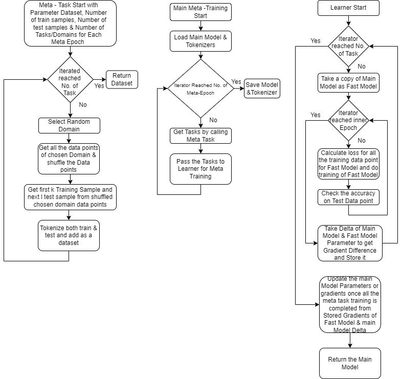
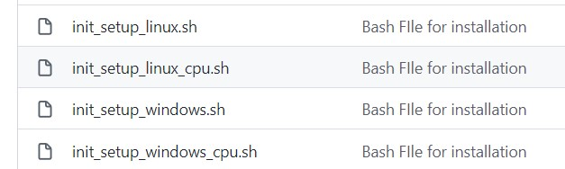
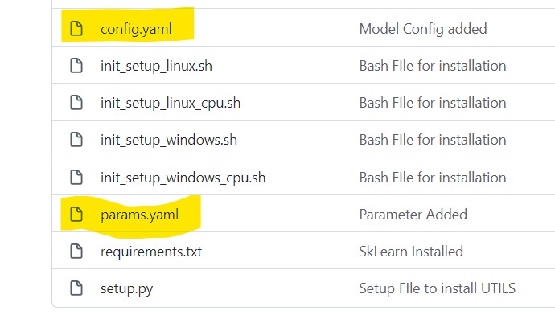

# Meta Learning the Huggingface Way

## Authors
**Nabarun Barua**     

[Git](https://github.com/nabarunbaruaAIML)/ [LinkedIn](https://www.linkedin.com/in/nabarun-barua-aiml-engineer/)/ [Towardsdatascience](https://medium.com/@nabarun.barua)

**Arjun Kumbakkara** 

[Git](https://github.com/arjunKumbakkara)/ [LinkedIn](https://www.linkedin.com/in/arjunkumbakkara/)/ [Towardsdatascience](https://medium.com/@arjunkumbakkara)

Meta - Learning is exciting trend in Research and before we jump into Project implementation, I think we first should understand Meta - Learning basics. 

In Traditional ML/DL approach, what we follow is we get huge dataset and we start training on that dataset and eventually we get good accuracy score.

Now Meta - Learning approach is like the way human learns, first Learns on one domain after getting knowledge then it tries to learn on next domain with handful of examples based on the knowledge aquired in the past. In this way, by repeating this step multiple times, we can improve the accuracy of model with limited training data. Now Meta-Learning works better than traditional approach of Fine-Tuning on huge Dataset where dataset has many domains because in traditional approach model at a time tries to learn on different random domains which increase to over all training time whereas in Meta-Learning Model learn a domain with k sample training data, what ever learning is being learnered is passed to the main model after every Epoch(Here for Every Main/Meta Epoch there are multiple Leaner Epoch teremed as Inner Epoch)

There are multiple types of Meta - Learning:
- metric-based meta-learning
    - Siamese Network
    - Matching Network
    - Prototypical Network
    - Relation Network
- optimization-based meta-learning
    - MAML (model-agnostic meta learning) 
    - FOMAML—First-Order MAML
    - Reptile 

Details for the above meta-learning techniques will be available in this [Paper](https://arxiv.org/pdf/2007.09604.pdf)

In our **Project** we used Reptile a variaent MAML (model-agnostic meta learning) from optimization-based meta-learning. In the root **Meta_Learning.py** we get complete meta-learning training process.

Now in Our Project in **Meta_Learning.py** we have two Function which are important
- Meta Task: This function creates n random Task i.e. n Domains for training with given K Samples for Training set & L samples for Test set.
- Leaner: This function trains for i epoch for each task given by Meta Task and update the gradients to the main model at the end of train for all the Task.

For detail process flow, please follow the flow chart below for overll Meta-Learning:



Now the Technical Stack:
- Huggingface Transformers
- Huggingface Datasets
- Huggingface Accelerate
- Pytorch

For the above Technical stack basic understand is needed. We are using Huggingface Datasets instead of Pytorch Datasets because Huggingface Datasets works on apache arrow format and Data processing is fast & quick. For better understand, please go through my previous blogs [Part 1](https://medium.com/mlearning-ai/forget-complex-traditional-approaches-to-handle-nlp-datasets-huggingface-dataset-library-is-your-1f975ce5689f) & [Part 2](https://medium.com/mlearning-ai/forget-complex-traditional-approaches-to-handle-nlp-datasets-huggingface-dataset-library-is-your-fe5de16d88c8). We are using Huggingface [Accelerate](https://huggingface.co/docs/accelerate/index) Library because we wanted a production ready multi-GPU/CPU code which can be deployed without much effort. Simple configuration takescare for single GPU/CPU or Multi-GPU approach without changing the code.

Now let's discuss about the project ([Github Link](https://github.com/nabarunbaruaAIML/Meta_Learning))

Fisrt step Start with setuping the enviorment, now to setup we have different bash files which will create local enviorment. Please select the bash file as per your need.



After setuping the local enviorment we are good to go for meta-learning but before we move to Meta-Learning python file. We should understand the dataset which we are using, below is the number of records per domain:

'apparel': 1717,

'baby': 1107,

'beauty': 993,

'books': 921,

'camera_&_photo': 1086,

'cell_phones_&_service': 698,

'dvd': 893,

'electronics': 1277,

'grocery': 1100,

'health_&_personal_care': 1429,

'jewelry_&_watches': 1086,

'kitchen_&_housewares': 1390,

'magazines': 1133,

'music': 1007,

'outdoor_living': 980,

'software': 1029,

'sports_&_outdoors': 1336,

'toys_&_games': 1363,

'video': 1010,

'automotive': 100,

'computer_&_video_games': 100,

'office_products': 100

We can see last three domain, namely Automotive, Computer & Video Games and Office Products have only 100 records therefore we take them for Test set whereas remaining others in Training set.

All the Configuration and Parameters to the Meta - Training are centrally given in the Config.yaml file & Params.yaml file which can be change to impact the training.



Now to execute training in multi-GPU or single GPU or CPU, we need to configure Accelerate to do that we just need to execute a command
```bash
accelerate config
```
Answer simple Question and it will generate config file for Accelerate Library which will be picked automatically during training(This execution is done once to create config file). This process is optional, if we want to execute our python file in traditional way then Accelerate Library will execute with default parameters which fits for single GPU Training.

Traditional way of executing the python file
```bash
python my_script.py
```
Now if we have multi GPU Setup and we want to train, after completion of Configuration. Just need to execute following Command.
```bash
accelerate launch my_script.py
```

In our example, my_script.py is Meta_Learning.py file. Once executing the above command training will start.

And you can see the result in the Folder named Logs in running_logs.log file. With this we came to end of our Blog post.

Inspiration for our work came from this [Github](https://github.com/mailong25/meta-learning-bert) which is implemented completely in pytorch, kindly visit and check if you want to implement your implementation completely pytorch way.


If you like this Blog please show your love and give us a thumbs up , star us  and if not please do give us a feedback in the comment section.
Here's hoping that you wil have fun with the library! 


##### For Collaboration , Help and Learning things together  - 
#### Join our Discord Server :  https://discord.gg/Z7Kx96CYGJ

#####  GodSpeed!


